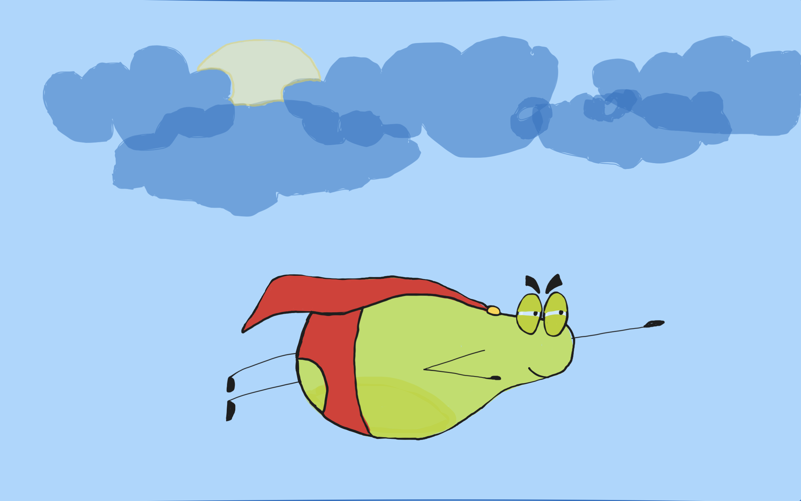

# 🍐 PearBoard

**PearBoard** is a peer-to-peer (P2P) collaborative whiteboard built using [Pear](https://holepunch.to/) technology.  
It allows multiple users to connect directly, draw together in real-time, and share ideas without relying on centralized servers.

---



---

## ✨ Features

- 🎨 Real-time drawing with pen, shapes, text, and eraser
- 🖱️ Mouse follower to see peers' cursors live
- 🔁 Undo and redo support
- 📡 Peer-to-peer connectivity powered by Pear
- 🧑‍🤝‍🧑 Multi-peer support for collaborative sessions
- 🚀 No servers required — all communication is direct

---

## 🛠 Tech Stack

- **Pear** (Holepunch stack: Hypercore, Hyperswarm)
- **JavaScript, HTML, CSS**
- **Canvas API** for rendering drawings
- **Live Collaboration**

---

## 📦 Installation

```bash
# Clone the repository
git clone https://github.com/Codesamp-Rohan/PearBoard.git
cd PearBoard

# Install dependencies
npm install

# Run the development server
npm run dev
or
pear run -d .
```

## 🚀 Usage

1. Run `npm run dev` to launch PearBoard locally.
2. Share your **Canvas Room Key** with collaborators.
3. Once connected, everyone’s strokes, shapes, and mouse positions will sync in real time.  

## 🎯 Roadmap

- [ ] File and image upload support
- [ ] Voice and video chat integration
- [ ] Persistent boards (save and load sessions)
- [ ] Improved UI with color palettes and toolbars

## Join Room

Join the [Keet Room](pear://keet/yfoik1wj341giyzf7tyr5efkyfdtrtfugamgw476muitdyfug6np4hcheycra1marpmuynsag6dpmy46gxawdu7pxd8kri1936euegcm1miqd6jm7gw3dwr99k69js1eihftwi8jrphozbxmgdzrgg4wop3t4ye) to discuss about the PearBoard.

## 🤝 Contributing

Pull requests are welcome.  
For major changes, please open an issue first to discuss what you would like to change.

## 📜 License

This project is licensed under the MIT License.  
See the [LICENSE](./LICENSE) file for details.